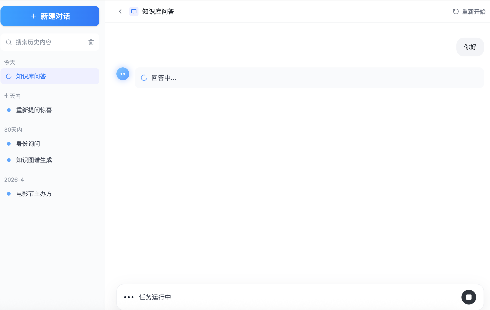
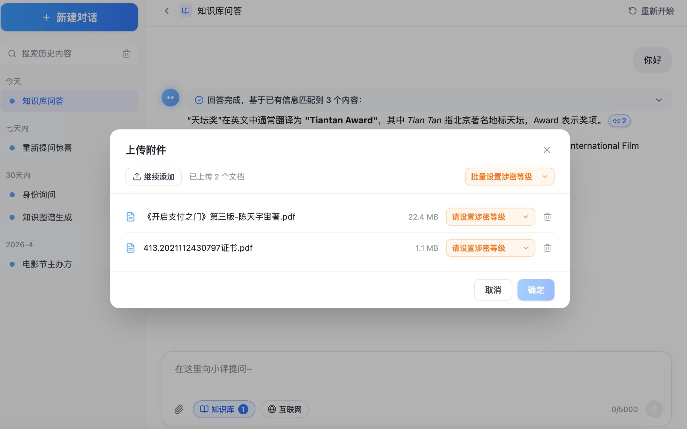
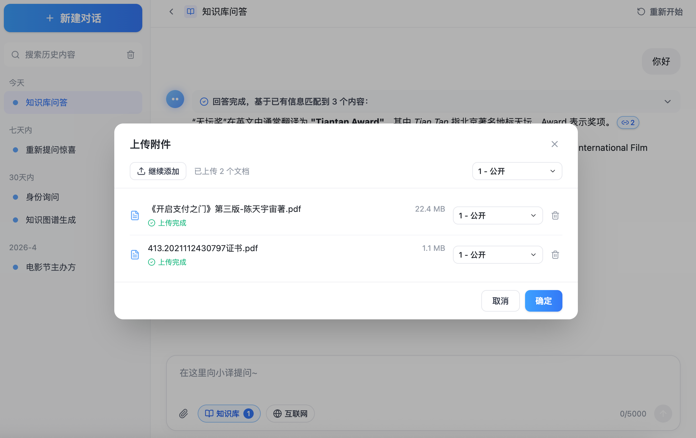
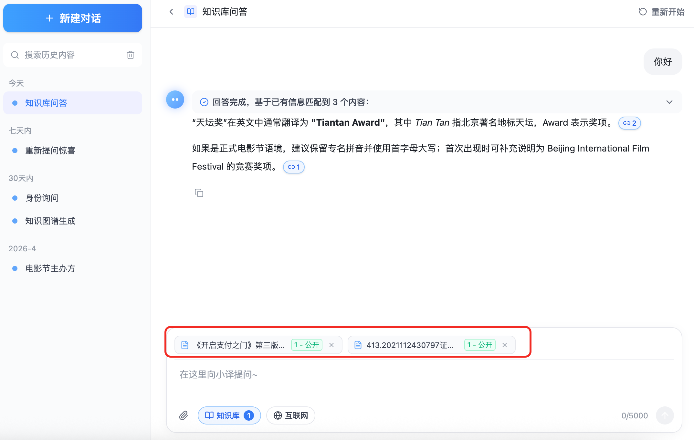
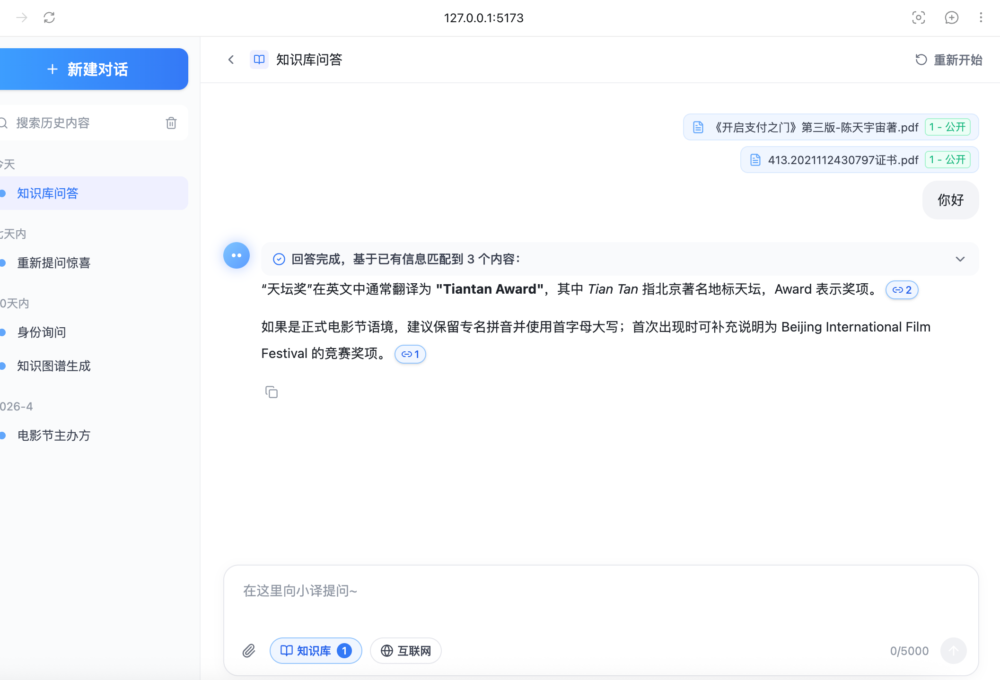
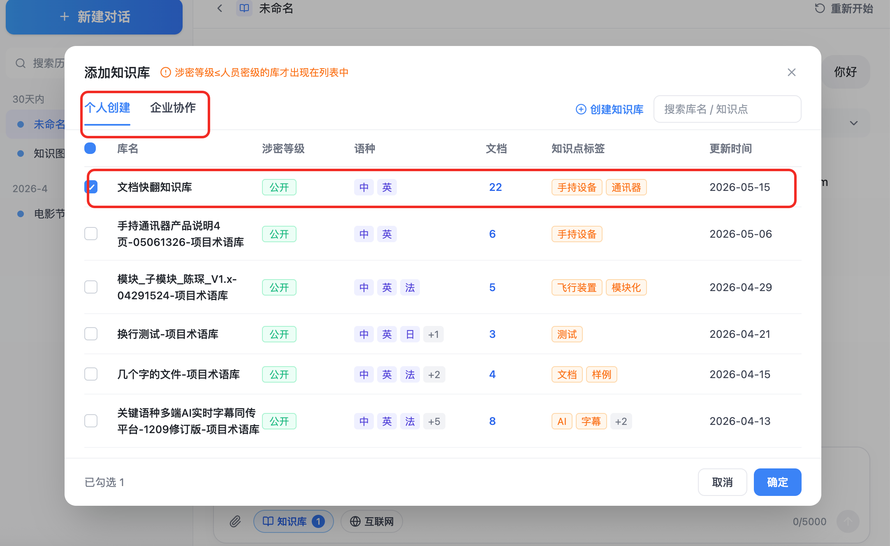
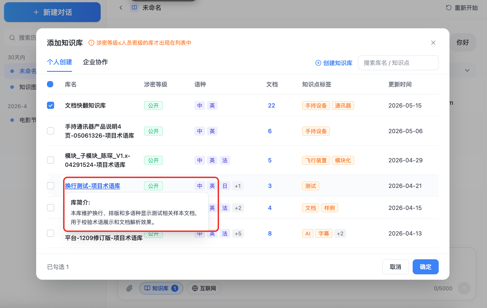
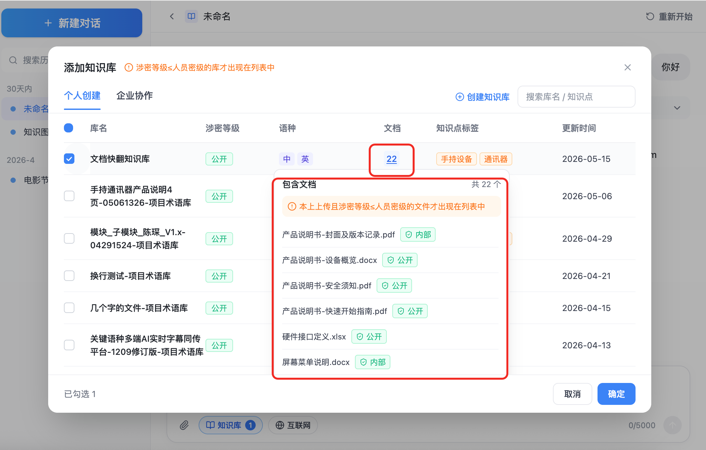

# 知识库问答产品需求文档 (PRD)

## 5. 详细功能说明

### 5.1 多语智能知识库问答

#### 5.1.1 新建对话

| 字段               | 说明                                                                       |
| ------------------ | -------------------------------------------------------------------------- |
| **功能编号** | CHT-01                                                                     |
| **功能描述** | 用户点击“新建对话”或顶部返回入口后进入空白会话状态，用于发起新的问答主题 |
| **前置条件** | 用户已进入问答工作台                                                       |
| **优先级**   | P0                                                                         |

**页面元素**：

| 元素         | 类型   | 说明                             | 校验规则                           |
| ------------ | ------ | -------------------------------- | ---------------------------------- |
| 新建对话     | 按钮   | 位于左侧侧边栏顶部               | 点击后清空输入框并取消当前会话选中 |
| 重新开始     | 按钮   | 位于顶部栏右侧                   | 点击后进入新建对话态               |
| 空白会话提示 | 空状态 | 展示“与小译一起，开启新的对话” | 仅草稿态展示                       |

**交互逻辑**：

1. 用户点击“新建对话”。
2. 系统取消历史会话 active 状态，进入草稿态。
3. 系统清空输入框，并关闭已打开的引用侧栏。
4. 用户输入并发送问题后，系统创建新会话。
5. ***新会话标题根据用户的提问进行AI提炼，最多15个字符。***

**页面截图：**

**异常处理**：

| 异常场景         | 处理方式                                   |
| ---------------- | ------------------------------------------ |
| 创建会话接口失败 | 保留输入内容，提示“会话创建失败，请重试” |
| 用户连续点击新建 | 只保留一个草稿态，不重复创建空会话         |

#### 5.1.2 问题输入与发送

| 字段               | 说明                                                                             |
| ------------------ | -------------------------------------------------------------------------------- |
| **功能编号** | CHT-03 / CHT-04                                                                  |
| **功能描述** | 用户输入问题并提交给 小译，系统基于知识库、互联网（支持开关)和附件上下文生成回答 |
| **前置条件** | 输入框可用                                                                       |
| **优先级**   | P0                                                                               |

**页面元素**：

| 元素       | 类型       | 说明                                             | 校验规则                                                                                                                                                                                                                                                |
| ---------- | ---------- | ------------------------------------------------ | ------------------------------------------------------------------------------------------------------------------------------------------------------------------------------------------------------------------------------------------------------- |
| 问题输入框 | 多行文本框 | 占位提示“在这里向小译提问~”                    | 最大 5000 字，去除首尾空格后不能为空                                                                                                                                                                                                                    |
| 字数统计   | 文本       | 展示当前输入长度/5000                            | 实时更新                                                                                                                                                                                                                                                |
| 附件       | 图标按钮   | 先唤起系统文件选择器，选择文件后进入附件上传弹窗 | 支持 `.pdf`、`.doc`、`.docx`、`.xls`、`.xlsx`、`.ppt`、`.pptx`、`.txt`、`.md`、.csv、.png、.jpg、.jpeg（***支持哪些格式需要开发确认***)；最多 5 个文件；单文件最大xM，所有附件最大xM, 需设置文件涉密等级后再执行上传操作 |
| 知识库     | 按钮       | 展示已选知识库数量并打开弹窗                     | 数量与选择结果一致                                                                                                                                                                                                                                      |
| 互联网     | 按钮       | 切换互联网检索                                   | 开启则进行联网查询，不开启不进行联网查询（***需要针对商户设置显影开关，开关关闭不显示不可用，开关打开则显示***)                                                                                                                                 |
| 发送       | 图标按钮   | 提交问题                                         | 空内容禁用；点击按钮或按 Enter 发送，Shift+Enter 换行                                                                                                                                                                                                   |
| 运行状态条 | 底部状态条 | 发送后替代输入区展示“任务运行中”和停止按钮     | 仅 AI 生成中展示；停止后恢复输入区                                                                                                                                                                                                                      |

**交互逻辑**：

1. 用户在输入框输入问题。
2. 系统实时展示字数统计。
3. 用户可选择知识库、开启互联网或上传附件。
4. 用户点击发送按钮或在输入框按 Enter 后，系统提交问题和上下文配置；Shift+Enter 支持用户问题换行。
5. 鼠标放入输入框，支持用户直接通过ctrl+v吊起附件添加弹窗，添加文件
6. 若输入区存在已上传附件，系统将附件移动到用户问题气泡上方展示，并清空输入区附件列表，避免重复发送。
7. 系统创建用户消息并展示生成中状态。
8. 生成中期间，主内容区展示用户问题气泡、助手“回答中...”占位状态；底部输入区切换为“任务运行中”状态条，右侧提供停止按钮。
9. 用户点击停止按钮后，系统终止本次生成任务，清除生成中状态并恢复输入区。
10. AI 返回完成后展示回答内容。

**页面截图**：

**异常处理**：

| 异常场景         | 处理方式                     |
| ---------------- | ---------------------------- |
| 输入为空         | 发送按钮禁用                 |
| 输入超过 5000 字 | 前端限制输入，并提示字数上限 |
| 网络超时         | 消息状态显示失败，提供重试   |
| 重复点击发送     | 生成中锁定发送按钮           |
| 用户主动停止生成 | 停止当前任务，保留已发送问题 |

#### 5.1.3 附件上传与涉密等级设置

| 字段               | 说明                                                           |
| ------------------ | -------------------------------------------------------------- |
| **功能编号** | CHT-09 / CHT-11                                                |
| **功能描述** | 用户可上传临时附件作为本轮问题上下文，并为每个附件设置涉密等级 |
| **前置条件** | 用户点击输入区附件图标并选择至少 1 个文件                      |
| **优先级**   | P0                                                             |

**页面元素**：

| 元素             | 类型     | 说明                                           | 校验规则                                                                                                                                         |
| ---------------- | -------- | ---------------------------------------------- | ------------------------------------------------------------------------------------------------------------------------------------------------ |
| 附件图标         | 图标按钮 | 点击后先唤起系统文件选择器                     | 已达 5 个附件后禁用                                                                                                                              |
| 上传附件弹窗     | 弹窗     | 选择文件后展示待上传文件列表                   | 点击遮罩关闭；上传中不可关闭                                                                                                                     |
| 继续添加         | 按钮     | 已有文件时展示，可继续选择文件                 | 空列表时隐藏；最多累计 5 个文件                                                                                                                  |
| 已上传数量       | 文本     | 展示“已上传 N 个文档”                        | 仅展示当前弹窗内文件数量，不展示上限                                                                                                             |
| 批量设置涉密等级 | 下拉框   | 批量设置所有文件的涉密等级                     | ***如果配置可修改密级，对所有文件生效，包括已上传完成文件 如果配置不可修改密级，对未设置密级的文件生效，已经设置密级的文件不生效*** |
| 文件涉密等级     | 下拉框   | 单文件设置涉密等级，占位文案“请设置涉密等级” | 上传中禁用；***文件设置密级后是否支持修改密级，需要根据配置来确定***                                                                     |
| 上传进度         | 进度条   | 文件上传中在文件行内展示进度条和百分比         | 进度需实时更新                                                                                                                                   |
| 上传完成标识     | 状态文本 | 上传完成后在文件行内展示“上传完成”           | 完成后保留                                                                                                                                       |
| 超限提示         | Toast    | 超过 5 个文件时用 toast 展示提示               | 不占用工具栏布局，自动消失                                                                                                                       |
| 确定             | 按钮     | 全部上传完成后确认，将附件回填到输入区         | 上传完成前禁用                                                                                                                                   |

**交互逻辑**：

1. 用户点击输入区附件图标，系统先唤起系统文件选择器。
2. 用户选择文件后，系统打开“上传附件”弹窗并列出文件。
3. 当文件列表为空时，顶部不展示“继续添加”，仅保留空态“选择文件”入口。
4. 用户可逐个设置涉密等级，也可通过“批量设置涉密等级”下拉框覆盖文件密级。
   1. ***如果配置可修改密级，对所有文件生效，包括已上传完成文件***
   2. ***如果配置不可修改密级，对未设置密级的文件生效，已经设置密级的文件不生效***
5. 当文件设置涉密等级后，系统自动开始上传。
6. 上传过程中，文件行展示进度条和百分比；上传完成后展示“上传完成”标识。
7. ***上传完成后，如果配置支持修改密级，用户仍可修改单个文件或批量修改文件的涉密等级。***
8. 用户点击确定后，附件以标签形式展示在输入框上方。
9. 用户输入问题并发送后，附件从输入区移动到用户问题上方，作为本次问题上下文展示。

**页面截图:**

**异常处理**：

| 异常场景          | 处理方式                                               |
| ----------------- | ------------------------------------------------------ |
| 文件数量超过 5 个 | 仅保留允许数量，并通过 toast 提示“最多上传 5 个文件” |
| 上传失败          | 文件行展示失败状态，允许删除后重新添加                 |
| 上传中关闭弹窗    | 上传中不可关闭                                         |

#### 5.1.4 AI 回答展示与回答操作

| 字段               | 说明                                               |
| ------------------ | -------------------------------------------------- |
| **功能编号** | CHT-05 / CHT-06                                    |
| **功能描述** | 系统展示 AI 回答、回答完成状态、引用标识和回答操作 |
| **前置条件** | 用户已提交问题                                     |
| **优先级**   | P0                                                 |

**页面元素**：

| 元素       | 类型          | 说明                                          | 校验规则                                                                             |
| ---------- | ------------- | --------------------------------------------- | ------------------------------------------------------------------------------------ |
| 用户气泡   | 消息气泡      | 展示用户问题                                  | 保留原文，支持换行                                                                   |
| 问题附件   | 附件标签组    | 展示本次发送问题关联的附件，位于用户问题上方  | 展示文件名和涉密等级                                                                 |
| 助手头像   | 图标          | 展示 小译 身份                                | 固定样式                                                                             |
| 回答状态条 | 状态按钮      | 展示“回答完成，基于已有信息匹配到 N 个内容” | 状态与接口返回一致                                                                   |
| 生成中占位 | 状态区域      | 展示“回答中...”及旋转加载标识               | 仅生成中展示                                                                         |
| 任务运行条 | 底部状态条    | 展示“任务运行中”和停止生成按钮              | 仅生成中展示                                                                         |
| 回答正文   | 富文本        | 展示 AI 回答内容                              | 内容需安全渲染，防 XSS ***需要支持mermaid图片的生成和查看mermaid代码*** |
| 引用标识   | 图标/数字按钮 | 展示对应回答片段命中的引用数量                | 仅存在引用时展示                                                                     |
| 回答操作   | 图标按钮      | 复制回答                                      | 点击后，toast提示：复制成功                                                          |

**交互逻辑**：

1. AI 生成中展示助手头像、“回答中...”加载占位和底部“任务运行中”状态条。
2. 生成中期间输入框隐藏或不可编辑，避免用户误以为可继续提交同一任务。
3. 用户点击底部停止按钮后，系统结束生成中状态并恢复输入框。
4. AI 完成后展示回答完成状态和命中数量。
5. 回答中命中知识库的位置展示引用标识。
6. 用户点击引用标识打开右侧引用内容面板。
7. 用户可复制回答

**页面截图**：

**异常处理**：

| 异常场景     | 处理方式                 |
| ------------ | ------------------------ |
| AI 服务失败  | 展示“回答失败，请重试” |
| 引用数量为 0 | 不展示引用标识           |

### 5.2 会话历史管理

#### 5.2.1 历史列表、搜索与切换

| 字段               | 说明                               |
| ------------------ | ---------------------------------- |
| **功能编号** | HIS-01 / HIS-02                    |
| **功能描述** | 用户在左侧查看、搜索并切换历史会话 |
| **前置条件** | 用户存在历史会话                   |
| **优先级**   | P0                                 |

**页面元素**：

| 元素       | 类型   | 说明                                | 校验规则                                 |
| ---------- | ------ | ----------------------------------- | ---------------------------------------- |
| 历史搜索框 | 输入框 | 按标题筛选会话                      | 空关键词展示全部                         |
| 时间分组   | 文本   | 今天、七天内、30 天内、月份         | 根据更新时间归类                         |
| 会话项     | 列表项 | 展示会话标题和选中态                | 超长标题后面打...，鼠标hvoer后可展示完全 |
| 运行中标识 | 图标   | 会话正在生成回答时展示 loading 标识 | 绑定具体运行会话                         |
| 空状态     | 文本   | 展示“无匹配记录”                  | 搜索无结果时展示                         |

**交互逻辑**：

1. 页面加载后展示用户历史会话。
2. 用户输入关键词后实时筛选标题。
3. 用户点击会话项后切换当前会话。
4. 当前会话高亮展示。
5. 若某个会话存在正在运行的回答任务，该会话列表项原蓝点位置展示旋转 loading 标识。
6. 运行中标识绑定到具体任务所属会话；用户切换到其他会话时，标识仍停留在原运行会话。

**页面截图**：

**异常处理**：

| 异常场景       | 处理方式                              |
| -------------- | ------------------------------------- |
| 搜索无结果     | 展示“无匹配记录”                    |
| 会话已被删除   | 从列表移除并toast提示：删除成功       |
| 删除运行中会话 | 终止该会话运行任务并清除 loading 标识 |

#### 5.2.2 会话重命名、单删与批量删除

| 字段               | 说明                                       |
| ------------------ | ------------------------------------------ |
| **功能编号** | HIS-03 / HIS-04 / HIS-05                   |
| **功能描述** | 用户可重命名历史会话，并删除单条或多条会话 |
| **前置条件** | 用户拥有对应会话管理权限                   |
| **优先级**   | P1                                         |

**页面元素**：

| 元素         | 类型     | 说明                   | 校验规则                 |
| ------------ | -------- | ---------------------- | ------------------------ |
| 重命名       | 图标按钮 | 悬浮会话项时展示       | 标题为空保存为“未命名” |
| 删除         | 图标按钮 | 删除单条会话           | 需要二次确认弹窗         |
| 批量选择入口 | 图标按钮 | 进入选择模式           | 选择模式下不可切换会话   |
| 全选         | 复选控件 | 勾选筛选结果内全部会话 | 无结果时不可用           |
| 批量删除     | 按钮     | 删除已选择会话         | 未选择时禁用             |

**交互逻辑**：

1. 用户悬浮会话项，展示重命名和删除按钮。
2. 点击重命名进入输入态，回车保存、Esc 取消。
3. 点击批量选择入口进入选择模式。
4. 用户勾选单条或全选后批量删除。
5. 删除当前会话后自动选中下一条，或进入新建态。

**页面截图**：

**异常处理**：

| 异常场景       | 处理方式         |
| -------------- | ---------------- |
| 标题为空       | 保存为“未命名” |
| 批量删除未选择 | 删除按钮禁用     |

### 5.3 知识库选择

#### 5.3.1 添加知识库弹窗

| 字段               | 说明                                         |
| ------------------ | -------------------------------------------- |
| **功能编号** | KB-01 / KB-03 / KB-05                        |
| **功能描述** | 用户选择一个或多个知识库作为当前问答检索范围 |
| **前置条件** | 用户点击输入区“知识库”按钮                 |
| **优先级**   | P0                                           |

**页面元素**：

| 元素       | 类型   | 说明                                         | 校验规则                                                                                                                                                                                                 |
| ---------- | ------ | -------------------------------------------- | -------------------------------------------------------------------------------------------------------------------------------------------------------------------------------------------------------- |
| 弹窗标题   | 文本   | 添加知识库                                   | 固定文案                                                                                                                                                                                                 |
| 涉密提示   | 提示   | 涉密等级≤人员密级的库才展示                 | 后端强过滤                                                                                                                                                                                               |
| 来源标签   | Tab    | 个人创建、企业协作                           |  ***个人创建：知识库的管理者对应的库，默认固定第一个知识库为：文档快翻知识库 ，其他知识库按照更新时间倒序排列。 企业协作：知识库的查看者、编辑者，知识库按照更新时间倒序排列。*** |
| 创建知识库 | 按钮   | 进入创建知识库流程                           | 点击浏览器新开页面，跳转到知识库页面，并弹出创建知识库弹窗                                                                                                                                               |
| 搜索框     | 输入框 | 搜索库名/知识点                              | 支持清空                                                                                                                                                                                                 |
| 知识库表格 | 表格   | 展示库名、密级、语种、文档数、标签、更新时间 | 长文本不溢出                                                                                                                                                                                             |
| 已勾选数量 | 文本   | 展示已选择数量                               | 实时更新                                                                                                                                                                                                 |
| 取消/确定  | 按钮   | 放弃或确认选择                               | 确定后回填数量                                                                                                                                                                                           |

**交互逻辑**：

1. 用户点击输入区知识库按钮。
2. 系统打开添加知识库弹窗。
3. 系统加载用户可见知识库列表。
4. 用户搜索、切换来源、勾选知识库。
5. 用户点击确定后关闭弹窗，并在输入区展示已选数量。

**页面截图**：

**异常处理**：

| 异常场景     | 处理方式             |
| ------------ | -------------------- |
| 无可见知识库 | 展示空状态和创建入口 |

#### 5.3.2 知识库信息与文档清单预览

| 字段               | 说明                                                     |
| ------------------ | -------------------------------------------------------- |
| **功能编号** | KB-06 / KB-07 / KB-10                                    |
| **功能描述** | 用户可在知识库列表中快速了解库简介、文档清单、密级和语种 |
| **前置条件** | 知识库弹窗已打开                                         |
| **优先级**   | P1                                                       |

**页面元素**：

| 元素           | 类型    | 说明                           | 校验规则                                                                                                                                                                                                                                                                                                                                                                               |
| -------------- | ------- | ------------------------------ | -------------------------------------------------------------------------------------------------------------------------------------------------------------------------------------------------------------------------------------------------------------------------------------------------------------------------------------------------------------------------------------- |
| 库简介悬浮层   | Tooltip | 展示知识库描述                 | 不遮挡关键操作                                                                                                                                                                                                                                                                                                                                                                         |
| 文档清单悬浮层 | Tooltip | 展示文件名、文件密级和文件数量 | 可滚动 文档快翻知识库，鼠标hover到文档个数后弹出的弹窗中，提示文案显示：  其他知识库，鼠标hover到文档个数后弹出的弹窗中，提示文案显示：  ***文档列表必须是该知识库中涉密等级≤人员密级的文件，后续在进行检索召回时，也只能在≤人员密级的文件 的切片中进行召回*** |
| 涉密等级标签   | 标签    | 展示公开、内部等               | 不高于人员密级                                                                                                                                                                                                                                                                                                                                                                         |
| 语种标签       | 标签组  | 展示中、英、法等简称           | 超过 x 个展示 +N                                                                                                                                                                                                                                                                                                                                                                       |
| 知识点标签     | 标签组  | 展示知识库标签                 | 超过 x 个展示 +N                                                                                                                                                                                                                                                                                                                                                                      |

**交互逻辑**：

1. 用户悬浮库名，系统展示库简介。
2. 用户悬浮文档数量，系统展示文档清单。
3. 文档清单内每个文件展示文件名和密级。
4. 多语种知识库展示前 3 个语种，超出部分以 +N 展示。

**页面截图**：

**异常处理**：

| 异常场景     | 处理方式                  |
| ------------ | ------------------------- |
| 文档数量过多 | 限制浮层高度并滚动        |
| 语种过多     | 展示前 x 个和 +N 折叠标签 |

### 5.4 引用溯源

#### 5.4.1 引用摘要下拉、引用标识与引用内容侧栏

| 字段               | 说明                                                                            |
| ------------------ | ------------------------------------------------------------------------------- |
| **功能编号** | REF-01 / REF-02 / REF-03 / REF-09 / REF-10                                      |
| **功能描述** | AI 回答命中文件或网站后，用户可通过回答摘要下拉、正文引用标识或侧栏查看引用来源 |
| **前置条件** | AI 回答返回引用数据                                                             |
| **优先级**   | P0                                                                              |

**页面元素**：

| 元素         | 类型       | 说明                                         | 校验规则                      |
| ------------ | ---------- | -------------------------------------------- | ----------------------------- |
| 引用摘要条   | 下拉按钮   | 展示“匹配到 N 个内容”和展开/收起箭头       | 数量=文件引用数+网站引用数    |
| 引用下拉列表 | 内联列表   | 展示回答使用的文件和网站来源                 | 默认收起，点击摘要条展开/收起 |
| 文件引用项   | 链接项     | 展示序号、文件图标、文件名和密级标签         | 文件名超长截断；密级标签必填  |
| 网站引用项   | 外链链接项 | 展示序号、网站图标、网站标题、域名和外链图标 | URL 必须为合法外部链接        |
| 引用标识     | 小按钮     | 展示回答片段引用数量                         | 点击打开侧栏                  |
| 引用内容面板 | 右侧侧栏   | 展示命中文件列表和命中网站列表               | 可关闭                        |
| 侧栏命中统计 | 文本       | 展示“命中 X 个文件、Y 个网站”              | 文件数、网站数与引用数据一致  |
| 关闭按钮     | 图标按钮   | 关闭引用侧栏                                 | 关闭后不影响会话              |

**交互逻辑**：

1. AI 回答完成后，系统展示引用摘要条。
2. 引用摘要条默认收起；用户点击摘要条或右侧箭头后，摘要条下方展开引用下拉列表。
3. 下拉列表同时展示文件引用和网站引用；文件引用必须展示密级标签，网站引用必须展示域名或来源站点。
4. 用户点击文件引用项后，浏览器新开页面进入原译对照预览；
   1. ***如果引用的内容有译文文件，则展示原译对照预览，并自动定位到第一个切片，切片内容黄底***
   2. ***如果引用的内容没有译文文件，则展示原文预览，并自动定位到第一个切片，切片内容黄底***
5. 用户点击网站引用项后，浏览器新开页面跳转到对应网站；
6. 回答正文命中位置展示引用标识。
7. 用户点击正文引用标识，右侧打开引用内容面板。
8. 引用内容面板顶部展示文件和网站的分类命中数量，例如“命中 2 个文件、1 个网站”。
9. 引用内容面板内先展示文件引用卡片，再展示网站引用卡片；两类内容均在同一个侧栏滚动区域内呈现。
10. 用户点击关闭按钮，侧栏收起。

**页面截图**：

**异常处理**：

| 异常场景       | 处理方式                     |
| -------------- | ---------------------------- |
| 引用数量为 0   | 不展示引用标识和引用面板入口 |
| 侧栏在窄屏溢出 | 以抽屉方式覆盖展示           |

#### 5.4.2 命中文件列表与网站来源列表

| 字段               | 说明                                                             |
| ------------------ | ---------------------------------------------------------------- |
| **功能编号** | REF-04 / REF-05 / REF-06 / REF-07 / REF-08 / REF-11              |
| **功能描述** | 系统展示回答依据文件和网站来源，并支持进入原译对照预览或外部网站 |
| **前置条件** | 引用下拉或引用内容面板已打开                                     |
| **优先级**   | P0                                                               |

**页面元素**：

| 元素       | 类型       | 说明                             | 校验规则                                         |
| ---------- | ---------- | -------------------------------- | ------------------------------------------------ |
| 文件卡片   | 链接卡片   | 可点击进入预览                   | 整卡可点击                                       |
| 网站卡片   | 外链卡片   | 在右侧引用内容面板中展示网站来源 | 整卡可点击；点击新开外部网站；不得影响当前问答页 |
| 文件引用项 | 内联链接项 | 在回答摘要下拉中展示文件来源     | 展示序号、文件图标、文件名、密级标签             |
| 网站引用项 | 外链链接项 | 在回答摘要下拉中展示网站来源     | 展示序号、网站图标、标题、域名；点击新开外部网站 |
| 网站来源   | 文本       | 展示网站域名或来源站点           | 必填；如 bjiff.com                               |
| 互联网标签 | 标签       | 标识该引用来源于互联网           | 仅网站引用展示                                   |
| 知识库来源 | 文本       | 展示文件所属知识库               | 必填                                             |
| 更新时间   | 文本       | 展示文件更新时间                 | 格式 YYYY-MM-DD HH:mm:ss                         |
| 文件名     | 文本       | 展示完整文件名                   | 长文本换行或截断                                 |
| 密级标签   | 标签       | 公开、内部等                     | 文件引用必填                                     |
| 语种标签   | 标签组     | 中、英等                         | 必填                                             |
| 命中摘要   | 文本       | 展示当前文档的AI生成的总结内容   | 默认截断展示；hover 后展示完整内容；             |
| 外链图标   | 图标       | 表示可预览或可跳转               | 非唯一点击区域                                   |

**交互逻辑**：

1. 侧栏展示所有有权限命中文件和已参与回答生成的网站来源。
2. 文件卡片展示知识库来源、更新时间、文件名、密级、语种和摘要。
3. 网站卡片展示网站来源、网站标题、互联网标签、域名标签、外链图标和简短说明。
4. 命中摘要默认展示摘要文本；鼠标 hover 文件卡片或摘要区域后，浮层展示完整文件摘要内容。
5. 命中摘要中的关键词不做黄色底高亮，保持普通文本样式。
6. 用户点击文件卡片后，通过浏览器新开页面进入原译对照预览；
7. 用户点击网站卡片后，通过浏览器新开页面进入对应网站；
8. 回答摘要下拉中的文件引用项与侧栏文件卡片跳转目标一致，均新开原译对照页面。
9. 回答摘要下拉中的网站引用项与侧栏网站卡片跳转目标一致，均新开浏览器页面访问对应网站。

**页面截图**：

**异常处理**：

无

### 5.5 原译对照预览

#### 5.5.1 预览模式切换

| 字段               | 说明                                                     |
| ------------------ | -------------------------------------------------------- |
| **功能编号** | DOC-01 / DOC-02 / DOC-03                                 |
| **功能描述** | 用户可在原译对照、原文、译文三种模式下查看命中文件及译文 |
| **前置条件** | 用户拥有文件预览权限                                     |
| **优先级**   | P0                                                       |

**页面元素**：

| 元素     | 类型     | 说明               | 校验规则           |
| -------- | -------- | ------------------ | ------------------ |
| 原译对照 | 分段按钮 | 左右展示原文和译文 | 默认选中           |
| 原文     | 分段按钮 | 单栏展示原文       | 保留切片高亮       |
| 译文     | 分段按钮 | 单栏展示译文       | 保留切片高亮       |
| 刷新     | 按钮     | 重新加载预览内容   | 保持当前模式       |
| 退出预览 | 按钮     | 关闭预览           | 返回知识库问答页面 |
| 文档页   | 阅读区域 | 展示标题和段落     | 不被顶部工具栏遮挡 |

**交互逻辑**：

1. 用户从命中文件卡片进入预览页。

   1. ***如果引用的内容有译文文件，则展示原译对照预览，并自动定位到第一个切片，切片内容黄底***
   2. ***如果引用的内容没有译文文件，则展示原文预览，并自动定位到第一个切片，切片内容黄底***
2. 系统默认展示原译对照模式。
3. 用户可切换原文或译文单栏模式。
4. 用户点击刷新，系统重新加载当前文件预览。
5. 用户点击退出预览，系统关闭页面或返回问答页。

**页面截图**：

**异常处理**：

| 异常场景     | 处理方式                          |
| ------------ | --------------------------------- |
| 文件解析中   | toast提示：文件解析中，请稍后     |
| 文件解析失败 | toast提示：文件解析失败，无法预览 |

#### 5.5.2 命中切片整段高亮

| 字段               | 说明                                           |
| ------------------ | ---------------------------------------------- |
| **功能编号** | DOC-04 / DOC-07                                |
| **功能描述** | 系统将回答依据所在的完整文档切片整段黄色底高亮 |
| **前置条件** | 文档预览数据包含命中切片范围                   |
| **优先级**   | P0                                             |

**页面元素**：

| 元素         | 类型     | 说明                   | 校验规则               |
| ------------ | -------- | ---------------------- | ---------------------- |
| 命中切片     | 文档段落 | 回答依据所在段落或片段 | 必须整段高亮           |
| 黄色高亮     | 背景样式 | 用黄色底标识命中切片   |                        |
| 原译对齐切片 | 对应段落 | 原文与译文对应片段     | 有对齐关系时两侧均高亮 |

**交互逻辑**：

1. 系统将完整切片整段加黄色背景。
3. 原文和译文存在对齐关系时，两侧对应切片均高亮。
4. 用户切换原文/译文模式后，高亮状态保持。

**页面截图**：

**异常处理**：

| 异常场景     | 处理方式         |
| ------------ | ---------------- |
| 命中切片跨段 | 高亮所有关联段落 |

### 5.6 安全要求

- [ ] 敏感数据加密存储
- [ ] 接口权限校验
- [ ] 防 SQL 注入/XSS 攻击
- [ ] 操作日志记录
- [ ] 人员密级与内容密级由后端强制执行
- [ ] 文档预览 URL 不得绕过权限校验
- [ ] AI 回答不得泄露无权限文件内容
- [ ] 网站引用跳转前需校验 URL 合法性，禁止 javascript: 等危险协议
- [ ] 文件引用和网站引用的新开页面行为需记录审计日志

### 5.7 兼容性要求

| 维度     | 支持范围                                                 |
| -------- | -------------------------------------------------------- |
| 浏览器   | Chrome 100+, Edge 100+, Safari 15+                       |
| 设备     | PC, Tablet                                               |
| 分辨率   | 1920×1080, 1440×900, 1366×768                         |
| 文件类型 | PDF, DOCX, XLSX, PPTX, TXT, Markdown，具体以后台配置为准 |

---

*文档结束*
