# 文档快翻智能问答需求文档 (PRD)

## 8. 详细功能说明

### 8.1 文档快翻智能问答入口

#### 8.1.1 打开智能问答抽屉

| 字段     | 说明                                                                       |
| -------- | -------------------------------------------------------------------------- |
| 功能编号 | MTQA-01                                                                    |
| 功能描述 | 用户在文档快翻翻译记录区域点击“智能问答”，系统从页面右侧打开智能问答抽屉 |
| 前置条件 | 用户已进入文档快翻页面                                                     |
| 优先级   | P0                                                                         |

**页面元素**：

| 元素               | 类型     | 说明                         | 校验规则                                                                                                                                                                                                                                |
| ------------------ | -------- | ---------------------------- | --------------------------------------------------------------------------------------------------------------------------------------------------------------------------------------------------------------------------------------- |
| 智能问答           | 按钮     | 位于翻译记录工具栏右侧       | 不勾选文件也可点击，点击进入新的问答会话 ***文档翻译、图片翻译都涉及到下方所有的需求***                                                                                                                                    |
| 文件勾选框         | 复选框   | 用户可勾选一个或多个翻译记录 | ***勾选的文件点击智能问答后，弹出智能问答弹窗，弹窗中的知识库自动勾选  “文档快翻知识库"，并自动选中已经勾选的关联文档 （如果文档已经翻译完成有译文文档在知识库，译文也需要被勾选；如果没有译文，只需要勾选原文文档；)*** |
| 智能问答抽屉       | 右侧抽屉 | 展示问答工作区               | 可以向左拖拉扩大                                                                                                                                                                                                                        |
| 关闭按钮           | 图标按钮 | 关闭抽屉                     | 关闭后保留文档快翻页面状态                                                                                                                                                                                                              |
| 进入完整页面       | 图标按钮 | 跳转完整智能问答页           | 点击直接跳转到智能问答页面，并                                                                                                                                                                                                          |
| 智能分析提示       | Toast    | 提示当前文档尚未完成智能分析 | 文案为“当前文档智能分析中，完成后可进行智能问答”                                                                                                                                                                                      |
| 无知识库与文件提示 | Toast    | 提示当前勾选的文件不在知识库 | ***文案为：“知识库暂无当前文档，未关联文档" 提示后可正常打开智能问答弹窗，只是没有自动关联知识库***                                                                                                                             |

**交互逻辑**：

1. 用户可直接点击“智能问答”，无需先勾选稿件。
2. ***勾选的文件点击智能问答后，弹出智能问答弹窗，弹窗中的知识库自动勾选  “文档快翻知识库"，并自动选中已经勾选的关联文档
   （如果文档已经翻译完成有译文文档在知识库，译文也需要被勾选；如果没有译文，只需要勾选原文文档）***
3. 若用户未勾选文件，系统仍打开抽屉，进入新的问答会话
4. 抽屉打开后，文档快翻左侧导航可收起，避免页面内容被挤压。
5. 用户点击关闭后，抽屉关闭，文档快翻页面筛选、分页、勾选状态不应被重置。
6. 用户点击“进入智能问答页面”icon 后，新开浏览器页面进入完整智能问答页面
7. 若已勾选文档中存在正在解析或正在生成概述与知识点的文档，用户点击“智能问答”时不打开抽屉，系统提示“当前文档智能分析中，完成后可进行智能问答”。
8. 若用户未勾选文档，或已勾选文档均已完成智能分析，则按原逻辑打开智能问答抽屉。

**页面截图：**

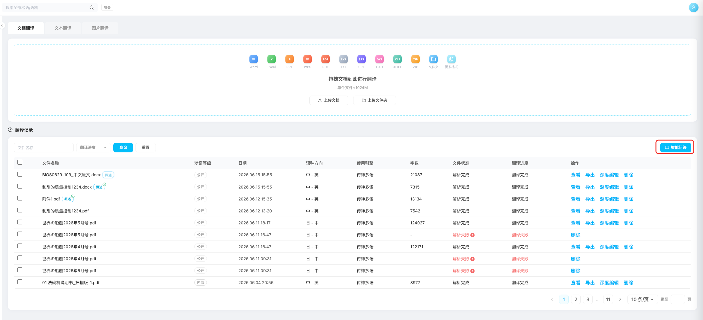

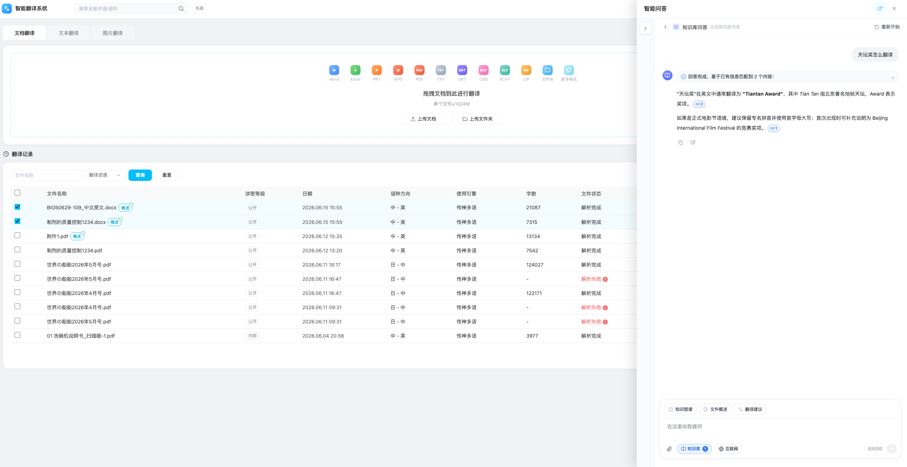

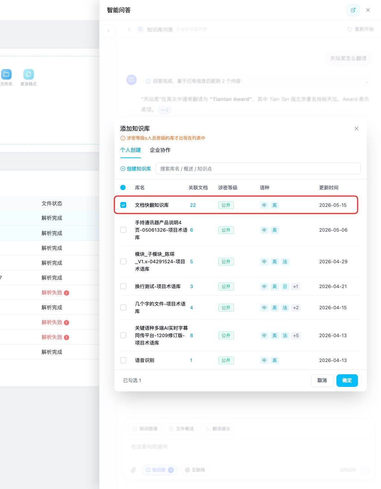

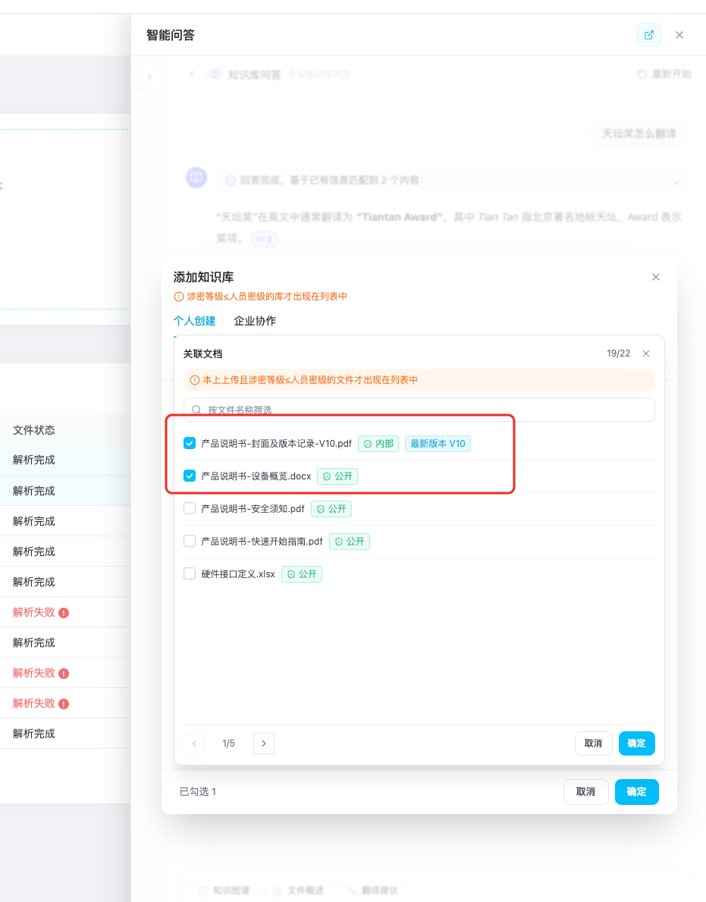

### 8.2 智能问答输入与快捷问题

#### 8.2.1 问题输入

| 字段     | 说明                                                                               |
| -------- | ---------------------------------------------------------------------------------- |
| 功能编号 | QA-01                                                                              |
| 功能描述 | 用户在抽屉或完整问答页输入问题，系统基于关联文档、知识库、附件和互联网开关生成回答 |
| 前置条件 | 问答工作区已打开                                                                   |
| 优先级   | P0                                                                                 |

**页面元素**：

| 元素   | 类型       | 说明                                   | 校验规则                                                                                           |
| ------ | ---------- | -------------------------------------- | -------------------------------------------------------------------------------------------------- |
| 输入框 | 多行文本框 | 占位文案“在这里向我提问”             | 最大 5000 字，去除首尾空格后不能为空                                                               |
| 发送   | 图标按钮   | 提交问题                               | 空内容禁用                                                                                         |
| 知识库 | 按钮       | 展示已选知识库数量，点击打开知识库弹窗 | 数量显示不挤压按钮                                                                                 |
| 互联网 | 开关按钮   | 开启或关闭互联网检索                   | 根据企业配置决定是否展示                                                                           |
| 附件   | 图标按钮   | 调用文件选择器并上传附件               | ***最多支持5个文件文件，格式与大小受配置限制（具体支持的文件类型、文件大小需要开发体统)*** |

**交互逻辑**：

1. 若用户通过快捷问题发送，输入框不需要先填入预设文案，直接发送对应问题。

#### 8.2.2 快捷问题按钮

| 字段     | 说明                                                             |
| -------- | ---------------------------------------------------------------- |
| 功能编号 | QA-02 / QA-03 / QA-04                                            |
| 功能描述 | 在输入框上方提供三个与文件和翻译相关的快捷问题，降低用户输入成本 |
| 前置条件 | 问答工作区已打开                                                 |
| 优先级   | P0                                                               |

**快捷问题配置**：

| 按钮文案 | 发送内容                       | 默认行为                   |
| -------- | ------------------------------ | -------------------------- |
| 知识图谱 | 根据关联文档，生成文档知识图谱 | 直接发送，不打开引用侧边栏 |
| 文件概述 | 根据关联文档，生成文档概述     | 直接发送，不打开引用侧边栏 |
| 翻译建议 | 根据关联文档，生成翻译建议     | 直接发送，不打开引用侧边栏 |

**页面截图**：

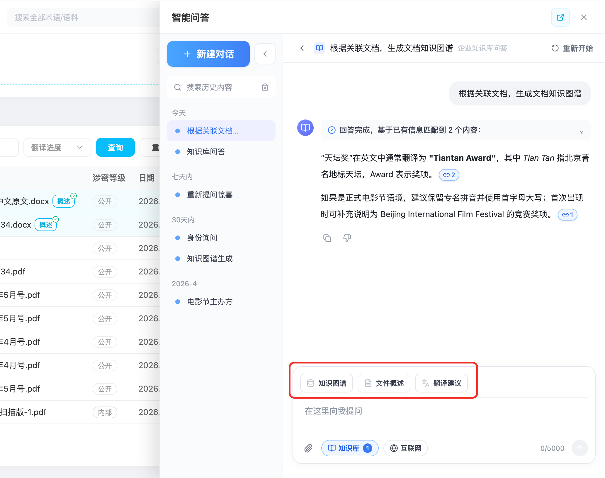

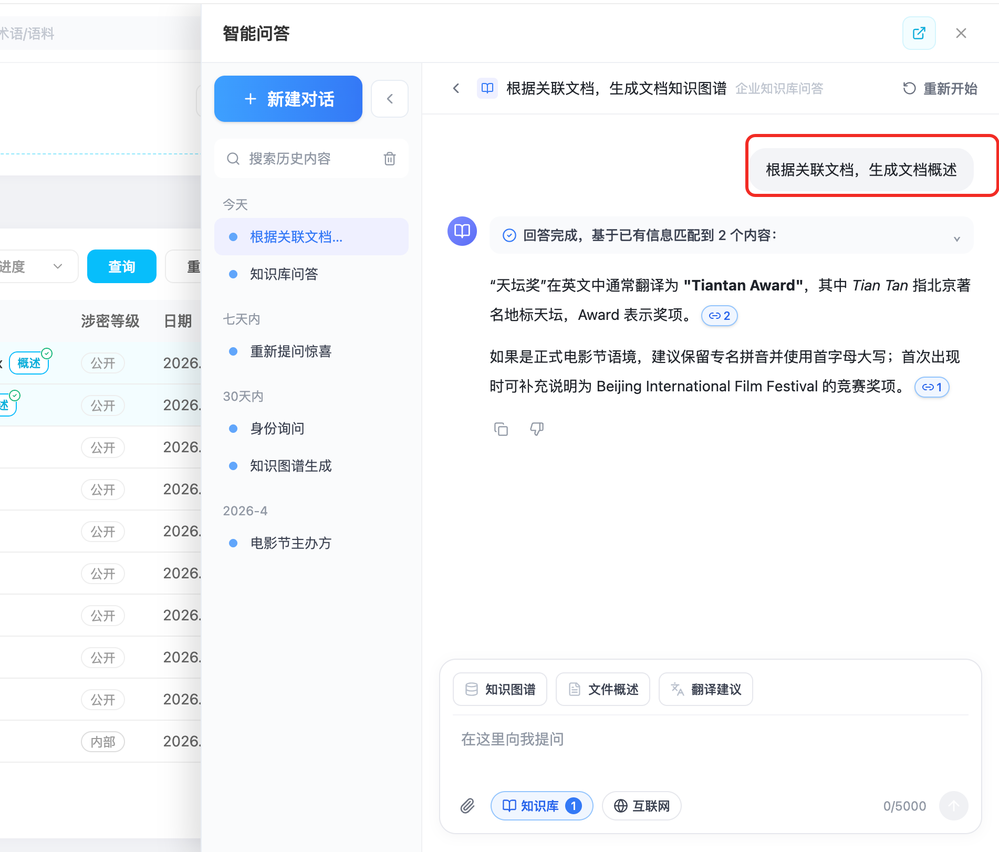

### 8.3 文件列表文件概述与知识点生成

#### 8.3.1 自动生成与状态展示

| 字段     | 说明                                                                       |
| -------- | -------------------------------------------------------------------------- |
| 功能编号 | SUM-01 / SUM-02 / SUM-03                                                   |
| 功能描述 | 文件进入翻译记录后，系统自动生成文件概述和知识点，并在文件名旁展示生成状态 |
| 前置条件 | 文件已提交到翻译记录                                                       |
| 优先级   | P0                                                                         |

**页面元素**：

| 元素              | 类型       | 说明                                     | 校验规则                             |
| ----------------- | ---------- | ---------------------------------------- | ------------------------------------ |
| 文件名            | 表格文本   | 展示翻译记录文件名                       | 超长单行省略，hover 可展示完整文件名 |
| 概述 loading icon | 状态图标   | 生成中展示“智能分析中” loading 态      | hover 提示“概要与知识点生成中...”  |
| 概述完成 icon     | 状态图标   | 生成完成展示“概述”镂空 icon 和完成标识 | 不造成表格列宽跳动                   |
| 概述预览层        | hover 浮层 | 展示文件概述与知识点                     |                                      |

**交互逻辑**：

1. 文件上传并进入翻译记录后，文件进入文档快翻知识库进行文档概述、知识点、切片等内容生成，生成完成后展示在翻译记录页面。
2. 概述任务状态为 `generating` 时，文件名旁展示“智能分析中” loading 状态。
3. 用户 hover loading 状态时，提示“概要与知识点生成中...”。
4. 概述任务状态为 `done` 时，文件名旁展示完成态 icon。
5. 用户 hover 文件名或概述 icon 时，系统展示浮层：上方直接展示文件概述正文，下方展示知识点标签。

**页面截图：**

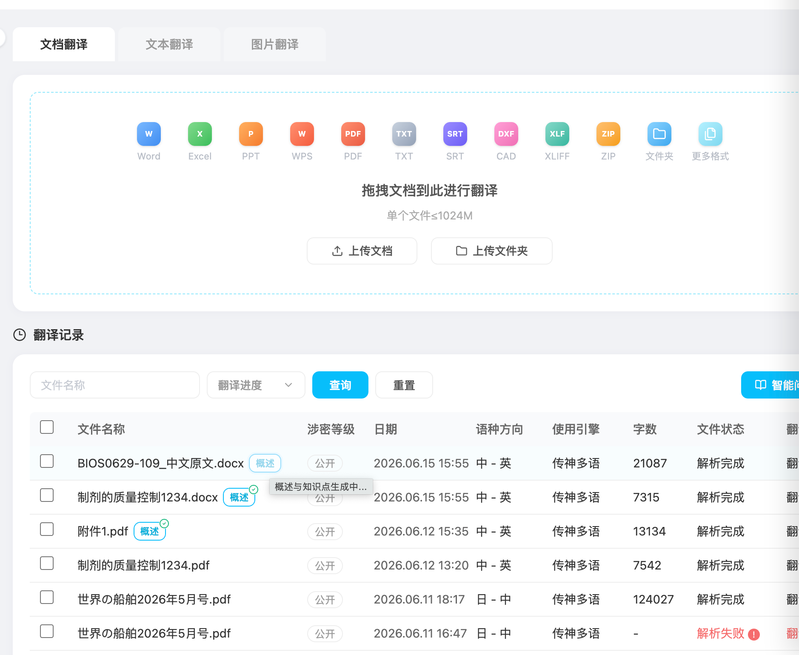

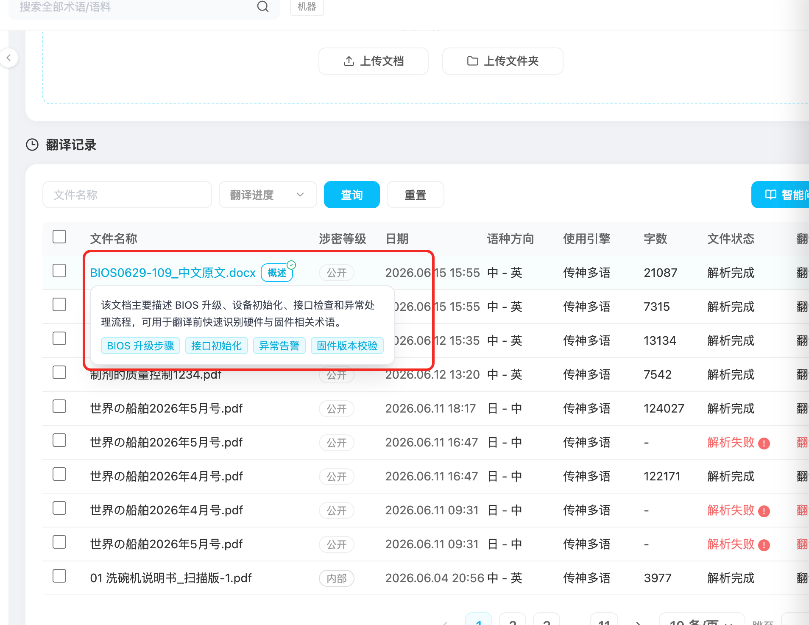

### 8.4 文档内容同步至知识库

#### 8.4.1 内容更新检测与入口

| 字段     | 说明                                                                                         |
| -------- | -------------------------------------------------------------------------------------------- |
| 功能编号 | KBSYNC-01                                                                                    |
| 功能描述 | 系统检测文档快翻中原文or译文已发生内容更新，支持用户查看待同步文档并将原文与译文同步至知识库 |
| 前置条件 | ***文档已进入文档快翻知识库，且原文或译文内容已经发送更新***                         |
| 优先级   | P0                                                                                           |

**页面元素**：

| 元素         | 类型     | 说明                                                                      | 校验规则                                                                                                                                                                                                                                  |
| ------------ | -------- | ------------------------------------------------------------------------- | ----------------------------------------------------------------------------------------------------------------------------------------------------------------------------------------------------------------------------------------- |
| 内容更新提示 | 辅助文案 | 位于“智能问答”按钮下方，展示“发现 N 份文档内容已更新，可同步到知识库” | N 为当前可同步文档数量；无待同步文档时不展示 ***原文or译文存在更新的内容(深度编辑中对原文or译文进行了编辑)，且原文已经在知识库中且为解析成功的状态 N为上述情况的原文文档的数量，N大于0在智能文档按钮下方展示对应提示*** |
| 查看         | 文字按钮 | 打开“待同步文档”弹窗                                                    | 打开时清空上次搜索、页码和勾选状态                                                                                                                                                                                                        |
| 同步中状态   | 状态文案 | 同步任务发起后展示“文档内容同步中...”                                   | 同步中不再展示“查看”入口，避免重复提交                                                                                                                                                                                                  |

**交互逻辑**：

1. 系统定期和在页面加载时校验文档内容是否较知识库中的版本有更新。
2. 存在待同步文档时，在“智能问答”按钮下方展示数量和“查看”入口。
3. 更新数量仅作为普通文本展示，不可点击，不触发 hover 浮层。
4. 用户点击“查看”后打开待同步文档弹窗。
5. 同步成功发起后，页面提示区更新为“文档内容同步中...”。

**页面截图：**

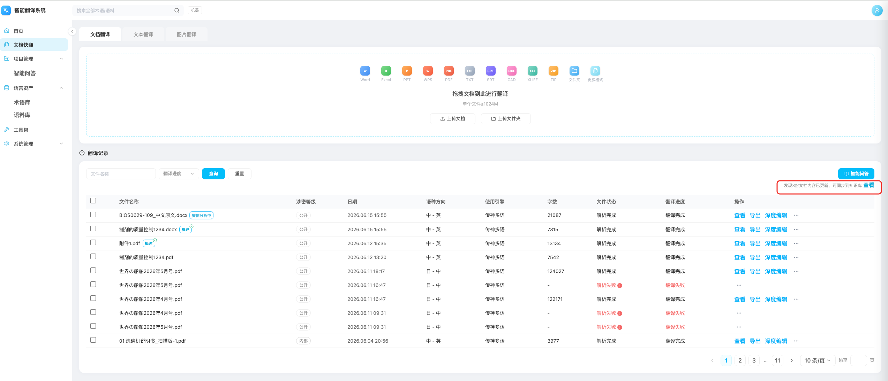

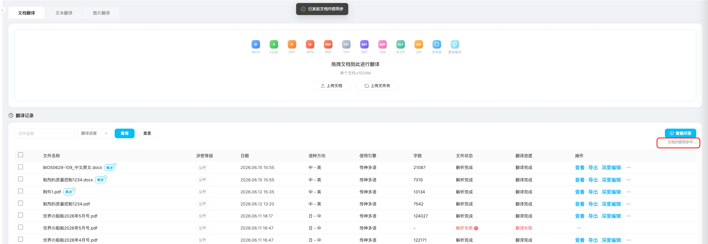

#### 8.4.2 待同步文档弹窗

| 字段     | 说明                                                         |
| -------- | ------------------------------------------------------------ |
| 功能编号 | KBSYNC-02                                                    |
| 功能描述 | 用户在弹窗中搜索、分页、勾选待同步文档，并发起知识库内容同步 |
| 前置条件 | 存在至少 1 份待同步文档                                      |
| 优先级   | P0                                                           |

**页面元素**：

| 元素         | 类型     | 说明                                                              | 校验规则                                                    |
| ------------ | -------- | ----------------------------------------------------------------- | ----------------------------------------------------------- |
| 弹窗标题     | 标题     | 展示“待同步文档”                                                | 固定文案                                                    |
| 弹窗副标题   | 说明文案 | 展示“发现 N 份文档内容已更新，可将原文与译文(如有)同步至知识库” | N 为待同步文档总数                                          |
| 文件名称搜索 | 输入框   | 按文件名称模糊筛选列表                                            | 输入关键词后自动回到第 1 页；无结果时展示“未找到匹配文档” |
| 文件列表     | 表格     | 展示勾选框、文件名、文件密级、更新时间                            | 文件名超长时单行省略，hover 可查看完整名称                  |
| 全选         | 复选框   | 勾选或取消勾选当前页文档                                          | 仅影响当前页，不改变其他页已选状态                          |
| 文件勾选框   | 复选框   | 选择需要同步的文档                                                | 弹窗每次打开时默认全部不勾选                                |
| 分页         | 分页器   | 展示总条数、页码、上一页、下一页和每页条数                        | 默认每页 5 条；页码切换不清空其他页勾选结果                 |
| 已选数量     | 辅助文案 | 弹窗底部展示“已选 N 份”                                         | 跨页累计已选文档数量                                        |
| 取消         | 次要按钮 | 关闭弹窗且不发起同步                                              | 关闭后不保留本次搜索与勾选状态                              |
| 同步         | 主按钮   | 将已勾选文档的原文与译文（如有）同步至知识库                      | 未勾选文档时禁用；已勾选至少 1 份文档时可点击               |

**交互逻辑**：

1. 弹窗每次打开时，文件搜索关键词为空、页码为 1、所有文档默认不勾选。
2. 用户可通过文件名称搜索缩小列表范围，搜索结果变化后页码自动回到第 1 页。
3. 用户可逐条勾选文档，也可使用表头复选框勾选当前页全部文档。
4. 切换页码时保留已选文档，弹窗底部实时展示跨页已选数量。
5. 未勾选任何文档时，“同步”按钮为禁用状态。
6. 用户勾选文档并点击“同步”后，系统关闭弹窗，提示“已发起文档内容同步”，并在页面上展示“文档内容同步中...”。
7. 同步内容包括所选文档的原文；若文档已生成译文，同时同步对应译文。

**页面截图：**

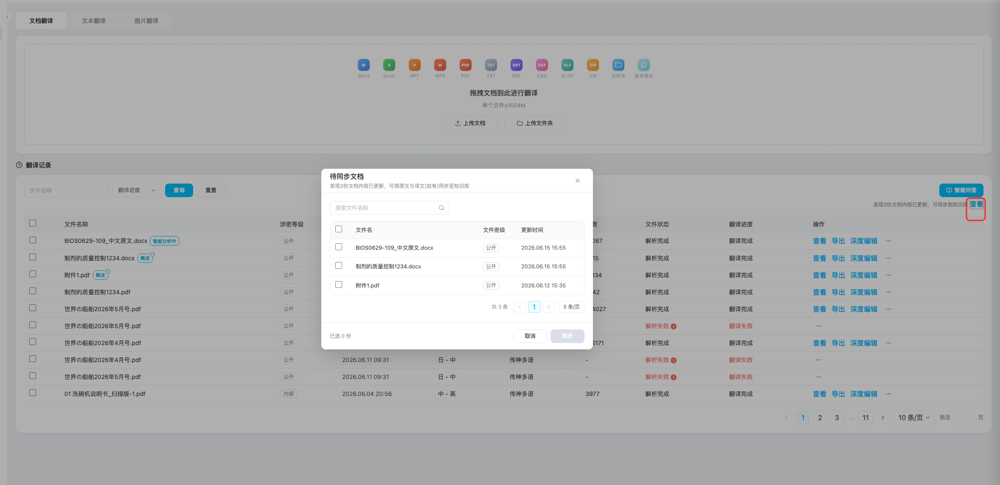

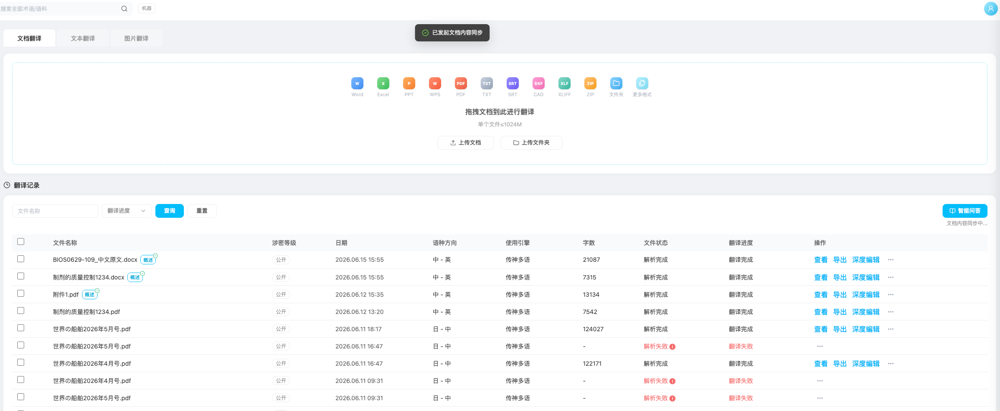

**异常处理**：

| 异常场景     | 处理方式                                                 |
| ------------ | -------------------------------------------------------- |
| 未勾选文档   | “同步”按钮禁用，不发起请求                             |
| 搜索无结果   | 列表展示“未找到匹配文档”，总条数展示 0                 |
| 重复点击同步 | 首次点击后关闭弹窗并切换为同步中状态，避免重复发起       |
| 同步请求失败 | 保留待同步文档，提示同步失败及失败原因，允许用户重新发起 |
| 文档无译文   | 仅同步原文，不影响本次任务成功状态                       |

#### 8.4.3 单文档知识库同步

| 字段     | 说明                                                   |
| -------- | ------------------------------------------------------ |
| 功能编号 | KBSYNC-03                                              |
| 功能描述 | 用户可从单条翻译记录的更多操作中发起该文档的知识库同步 |
| 前置条件 |                                                        |
| 优先级   | P0                                                     |

**交互逻辑**：

1. 翻译记录操作列直接展示“查看”、“导出”和“深度编辑”；次要操作收纳至三点“更多操作”菜单。
2. 点击三点菜单后，展示“知识库同步”和“删除”两个操作。
3. 用户点击“知识库同步”后，菜单关闭，系统提示“已发起文档内容同步”。
   1. ***将原有的原文、译文(如有)从知识库中删除，将最新的的原文、译文同步至知识库进行分析与切片***

**页面截图：**

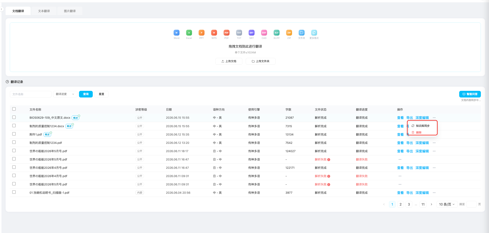

