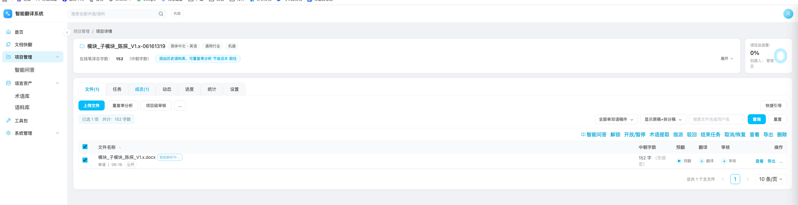
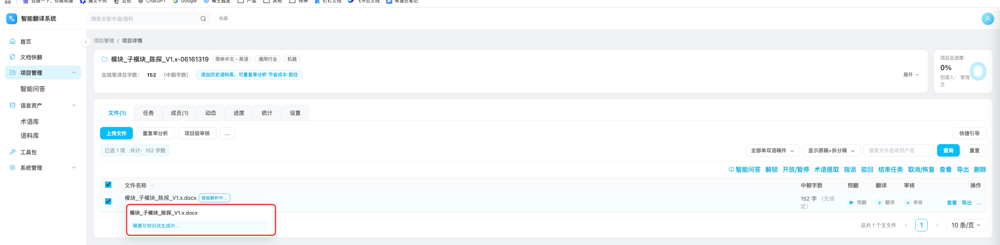
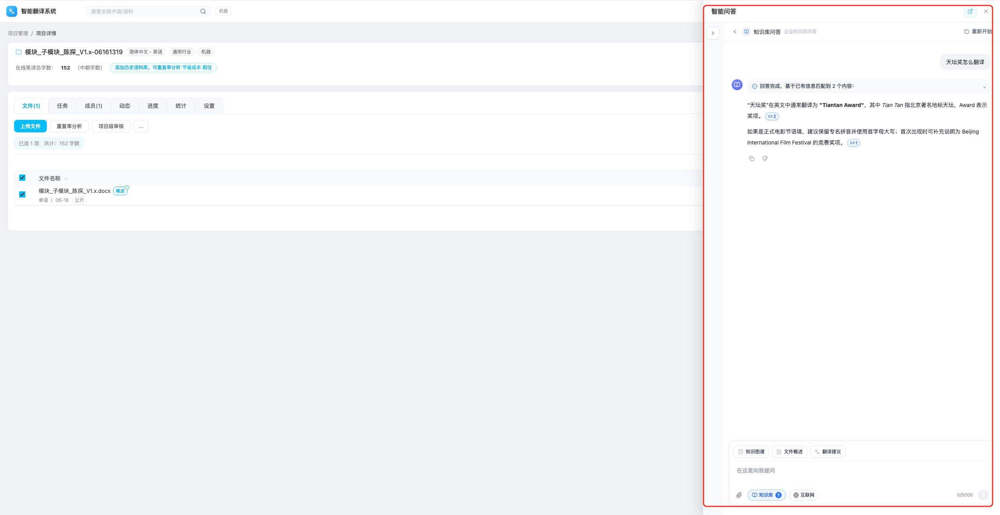
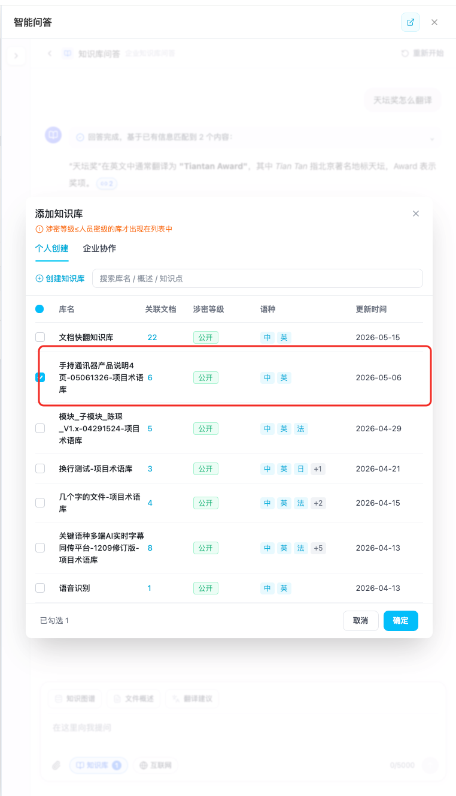
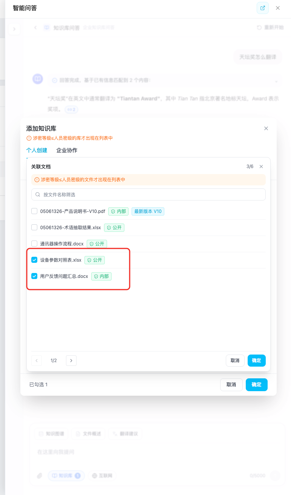
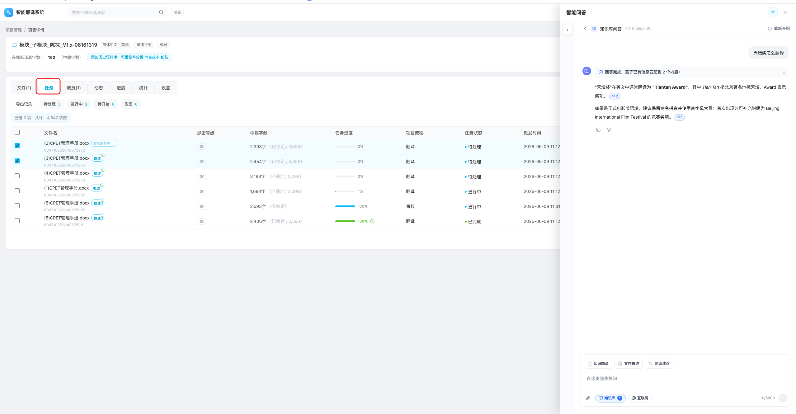
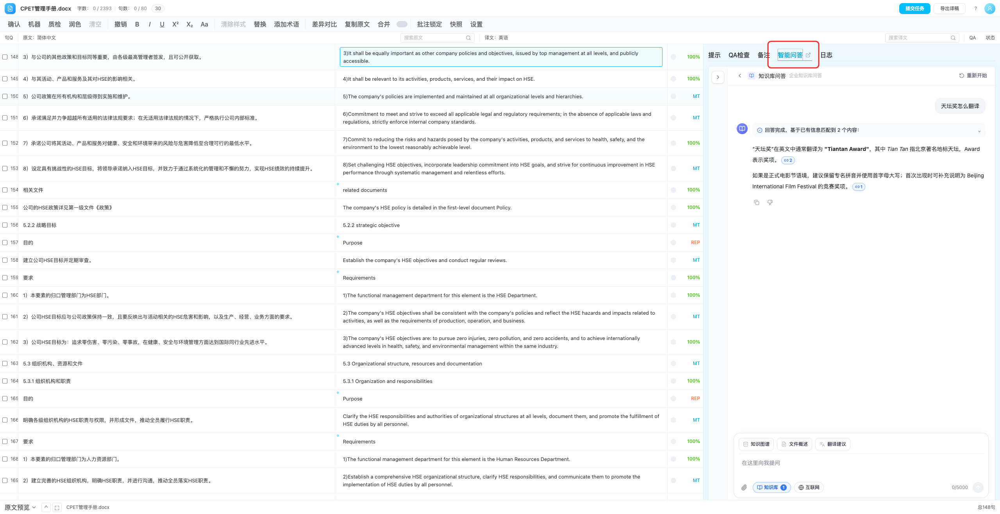
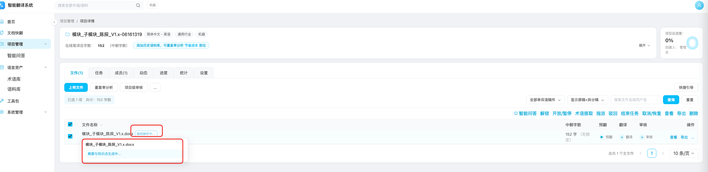
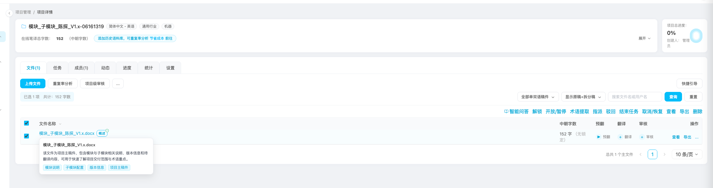
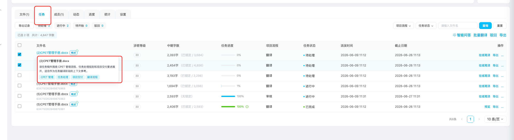

# 项目管理需求文档 (PRD)

## 7. 详细功能说明

### 7.5 项目智能问答联动

#### 7.5.1 打开智能问答抽屉

| 字段     | 说明                                                         |
| -------- | ------------------------------------------------------------ |
| 功能编号 | PRO-15 / PRO-16                                              |
| 功能描述 | 用户在文件或任务页签打开智能问答抽屉，并基于项目关联文档提问 |
| 前置条件 | 用户已进入项目详情，拥有问答权限                             |
| 优先级   | P0                                                           |

**页面元素**：

| 元素         | 类型     | 说明                    | 校验规则                                                                                                                                                                                                                                                                                |
| ------------ | -------- | ----------------------- | --------------------------------------------------------------------------------------------------------------------------------------------------------------------------------------------------------------------------------------------------------------------------------------- |
| 智能问答     | 按钮     | 位于文件/任务批量操作区 | ***文件/任务页签无选中项时可点击划出智能问答（此时为新建智能问答，不关联任何文档）； 勾选文件，点击智能问答（此时为新建智能问答，关联选中文档与对应知识库）；***  ***全部任务、我的任务、可领取任务都提供勾选任务，点击智能问答，右侧划出智能问答弹窗*** |
| 智能问答抽屉 | 右侧抽屉 | 嵌入完整问答工作区      | 抽屉打开后不重置项目页面状态                                                                                                                                                                                                                                                            |
| 关闭按钮     | 图标按钮 | 关闭抽屉                | ***关闭后清空文件/任务的勾选状态***                                                                                                                                                                                                                                             |
| 进入完整页面 | 图标按钮 | 跳转完整智能问答页      | 跳转后保留关联上下文                                                                                                                                                                                                                                                                    |
| 知识库按钮   | 按钮     | 展示已选知识库数量      | 默认应关联项目知识库或文档快翻知识库                                                                                                                                                                                                                                                    |

**交互逻辑**：

1. 用户在文件页签或任务页签勾选稿件。
2. 用户点击“智能问答”。
3. 系统从页面右侧打开智能问答抽屉。
4. ***若用户已勾选文件或任务，系统自动关联对应项目文档与对应知识库；若译文已生成，应同时关联原文和译文。***
   1. ***用户如果没有勾选文件或任务，开智能问答抽屉，新建一个空白的会话***
5. 抽屉打开后，用户可使用快捷问题“知识图谱”“文件概述”“翻译建议”，或直接输入问题。
6. 用户关闭抽屉后，项目详情页保持原页签、筛选、分页***，需要清空勾选状态。***

**页面截图：**

**异常处理**：

| 异常场景                                                | 处理方式                                                              |
| ------------------------------------------------------- | --------------------------------------------------------------------- |
| 选中文档尚未入库（文档在知识库没有解析完毕，或解析失败) | ***点击智能问答，toast提示：文档智能解析中，请等待解析完成*** |

#### 7.5.2 在线笔译侧栏智能问答

| 字段     | 说明                                                                                           |
| -------- | ---------------------------------------------------------------------------------------------- |
| 功能编号 | PRO-19 / PRO-20                                                                                |
| 功能描述 | 用户在在线笔译页面右侧栏切换“智能问答”页签，并可点击页签文字旁的外链图标新开完整智能问答页面 |
| 前置条件 | 用户已从项目文件或任务进入在线笔译页面，且拥有智能问答权限                                     |
| 优先级   | P0 / P1                                                                                        |

**页面元素**：

| 元素           | 类型     | 说明                                                   | 校验规则                                             |
| -------------- | -------- | ------------------------------------------------------ | ---------------------------------------------------- |
| 智能问答页签   | Tab      | 位于在线笔译页面右侧栏，与提示、QA检查、备注、日志并列 | 文案固定为“智能问答”                               |
| 外链图标       | 图标按钮 | 位于“智能问答”文字旁，用于新开完整问答页             | 使用通用外链图标；hover 提示“新开页面进入智能问答” |
| 右侧嵌入问答区 | 内容区域 | 在在线笔译右侧栏内嵌入智能问答工作区                   | 选中“智能问答”页签时展示；宽度应扩展到可用问答宽度 |
| 完整智能问答页 | 独立页面 | 新浏览器页面打开完整智能问答工作区                     |                                                      |

**交互逻辑**：

1. 用户进入在线笔译页面后，右侧栏展示“提示、QA检查、备注、智能问答、日志”等页签。
2. ***用户点击“智能问答”页签，系统在右侧栏内嵌入智能问答工作区。***
   1. ***智能问答默认勾选了webcat对应任务的文档，可能对应多个文档***
   2. ***进入webcat页面，首次打开智能问答tab，新建一个会话并将知识库和文档进行关联，后续打开智能问答tab都不新建会话，保留之前的会话内容***
3. 用户点击“智能问答”文字旁的外链图标，系统使用新浏览器页面打开完整智能问答页。
4. 外链点击不应改变当前在线笔译页面的页签、编辑内容、筛选状态和任务上下文。

**页面截图：**

### 7.6 文件概述与知识点

#### 7.6.1 自动生成与预览

| 字段     | 说明                                                               |
| -------- | ------------------------------------------------------------------ |
| 功能编号 | PRO-08                                                             |
| 功能描述 | 文件进入项目后，系统生成概述和知识点，辅助项目理解和问答上下文检索 |
| 前置条件 | 文件已上传或任务已生成，文件解析完成                               |
| 优先级   | P1                                                                 |

**页面元素**：

| 元素           | 类型       | 说明                                                                                                              | 校验规则                            |
| -------------- | ---------- | ----------------------------------------------------------------------------------------------------------------- | ----------------------------------- |
| 概述生成中图标 | 状态图标   | ***项目详情-文件列表、项目详情-任务(全部任务、我的任务、可领取任务)的文件名旁展示“智能解析中...”状态*** | hover 提示“概要与知识点生成中...” |
| 概述完成图标   | 状态图标   | ***项目详情-文件列表、项目详情-任务(全部任务、我的任务、可领取任务)的文件名旁展示完成状态***              | 图标占位稳定，不造成表格跳动        |
| 概述浮层       | Hover 浮层 | ***项目详情-文件列表、项目详情-任务(全部任务、我的任务、可领取任务)的展示概述正文和知识点标签***          | 浮层不遮挡关键操作按钮              |
| 知识点标签     | 标签       | 展示文件主题、术语或业务要点                                                                                      | 标签过多时折叠展示                  |

**交互逻辑**：

1. 文件进入项目后，系统创建概述与知识点生成任务。
2. 生成中时，文件名旁展示 loading 状态。
3. 生成完成后，文件名旁展示完成图标。
4. 用户 hover 文件名或图标时，系统展示概述和知识点。

**页面截图：**

**异常处理**：

| 异常场景     | 处理方式               |
| ------------ | ---------------------- |
| 文件解析失败 | 不展示文件概述、知识点 |
